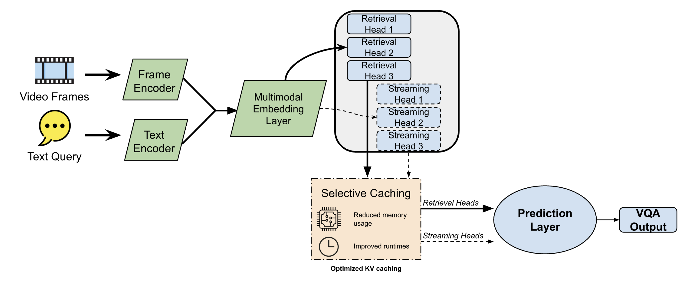

# DuoAttention with VILA



This repository demonstrates how to integrate the DuoAttention framework into the VILA model for improved efficiency and scalability in long-context Video Question Answering (VQA). By using DuoAttention, we significantly reduce memory usage and maintain or even slightly improve accuracy, making it more practical to handle large-scale video data, including real-time video feeds.

## Overview

- **DuoAttention Integration:**  
  The DuoAttention framework assigns different attention heads as either retrieval or streaming heads. Retrieval heads retain global context, while streaming heads focus on recent tokens to reduce KV cache size. Integrating this method into VILA results in more memory-efficient inference without substantially compromising accuracy.

- **VideoNIAH Benchmark:**  
  We evaluate our approach using the Video Needle In A Haystack (VideoNIAH) benchmark, which tests the model's ability to identify specific "needle" elements hidden in long, diverse videos. This setup provides a rigorous assessment of both accuracy and efficiency in handling extended video sequences.

## Demo

We have prepared a short demo video that compares the baseline VILA model with our DuoAttention-integrated variant. This demonstration highlights the memory and efficiency improvements gained through DuoAttention.

https://github.com/user-attachments/assets/38b173f0-bc40-4a3e-972c-fdad53f627dc

## Installation and Setup

1. **Download the Dataset:**
   - Download and unzip the [VideoNIAH dataset](https://drive.google.com/file/d/1KOUzy07viQzpmpcBqydUA043VQZ4nmRv/view).
   - Add the unzipped folder to your Google Drive and rename it to `VNBench`.

2. **Download the Annotations:**
   - Download the [annotation JSON file](https://huggingface.co/datasets/videoniah/VNBench/tree/main).
   - Add the JSON file to your Google Drive and name it `VNBench-annotations.json`.

3. **Colab Setup:**
   - Make a copy of our [Colab notebook](https://colab.research.google.com/drive/1lAEoKNh8pOMFEkHvex5vlOMM8s-DXmB1?usp=sharing) to your Google Drive.
   - This notebook includes code for setup, training, and evaluation using DuoAttention in VILA.

## Training

We perform training on Google Colab with an Ampere GPU (e.g., L4 or A100).

- **Training Steps:**
  1. Open the copied [notebook](https://colab.research.google.com/drive/1lAEoKNh8pOMFEkHvex5vlOMM8s-DXmB1?usp=sharing).
  2. Change the Colab runtime to a GPU runtime, preferably an L4 or A100 for best results.
  3. Run the setup cells to install dependencies and configure the environment.
  4. Run the training sections to train VILA with DuoAttention on the VideoNIAH dataset.

- **Scripts and Modifications:**
  The detailed training scripts and modifications are contained in this [repository](https://github.com/camila-zavala/duo-attention-tinyML) forked from the DuoAttention repository. This fork includes adjustments for training within Colab and for integrating DuoAttention with VILA specifically.

## Running the Demos

### Running Baseline Demo:

Ensure that you have run: `./environment_setup.sh`

Then, in the VILA directory:
```
python -W ignore llava/eval/run_vila_demo.py
```

### Running DuoAttention Demo

Ensure that you have run: `./environment_setup_duo.sh`

Then,
```
python -W ignore llava/eval/run_vila_duo_demo.py
```
